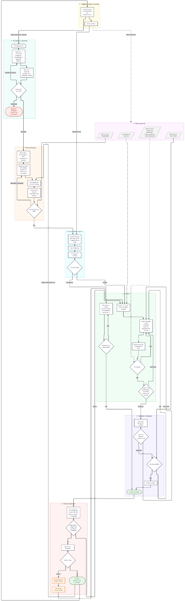
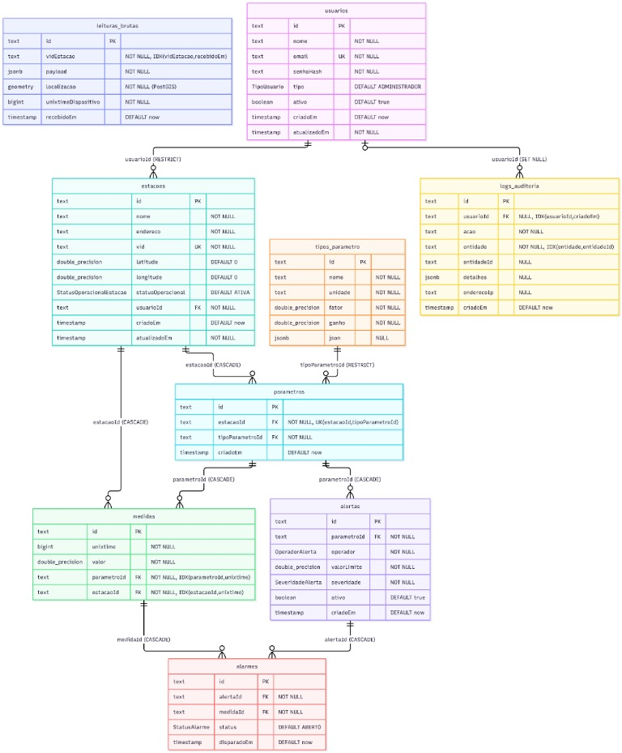

# KP-4DSM-API — Sistema de Monitoramento e Alertas de Desastres Naturais

## Equipe Kernel Panic

<div align="center">


[A Dor do Cliente](#a-dor) | 
[A Solução](#a-solução) |
[O Desafio](#o-desafio) | 
[DoR](#dor) |
[DoD](#dod) | 
[Backlog de Produto](#backlog-de-produto) | 
[Backlog da Sprint](#backlog-da-sprint) | 
[Tecnologias](#tecnologias-utilizadas) |
[Arquitetura](#arquitetura-do-projeto) |
[Modelagem de Dados](#modelo-de-dados) |
[Estrutura do Projeto](#estrutura-do-projeto) | 
[Instalação](#manual-de-instalação) | 
[Equipe](#autores)

</div>

---

<a id="a-dor"></a>
## 🎯 A Dor do Cliente

A Defesa Civil enfrenta desafios críticos na prevenção e resposta a desastres naturais:

- **Falta de visibilidade em tempo real** sobre condições meteorológicas em múltiplas regiões
- **Monitoramento fragmentado** com dados de diferentes fontes não integradas
- **Atrasos na detecção de anomalias** que levam a perda de vidas e danos materiais
- **Impossibilidade de correlacionar eventos** entre estações para identificar padrões de risco
- **Falta de auditoria e rastreabilidade** dos dados meteorológicos para fins legais e de compliance (LGPD)
- **Indisponibilidade de dados abertos** para integração com sistemas estaduais e federais

Impacto: Sem visibilidade consolidada sobre os parâmetros meteorológicos críticos e alertas automáticos, a instituição sofre com resposta lenta a emergências, falta de confiança nos dados e dificuldade em coordenar ações com outros órgãos governamentais.

---

<a id="a-solução"></a>
## 🚀 A Solução

A nossa solução é uma plataforma SaaS integrada de monitoramento e alerta de desastres naturais desenvolvida para comercialização junto ao setor público, com foco prioritário em Defesa Civil municipal e estadual.

A solução opera de ponta a ponta: centraliza o ciclo de vida comercial e operacional dos contratos licitatórios, controla o inventário de hardware em campo e fornece aos gestores públicos um ambiente robusto para acompanhamento de telemetria, detecção antecipada de eventos críticos e gestão de riscos em tempo real.

### Componentes Principais da Solução

#### 1. Gestão de Contratos, Licitações e Clientes
- **Gestão de Processos Licitatórios e Contratos:** Cadastro de licitações ganhas, vigência contratual, SLAs, termos de referência e aditivos.
- **Hierarquia e Vínculo de Ativos:** Associação de cada contrato/órgão às suas respectivas estações meteorológicas e sensores.
- **Isolamento de Dados (*Multi-tenant*):** Ambientes seguros e isolados para cada órgão contratante (ex.: Defesa Civil Municipal de diferentes cidades), permitindo visão global para a Tecsus e visão dedicada para o cliente final.

#### 2. Gestão de Infraestrutura e Ativos de Campo

- **CRUD e Inventário de Estações:** Cadastro de estações com geolocalização exata, área de cobertura e microclima atendido.
- **Composição Dinâmica de Sensores:** Mapeamento de periféricos por estação (pluviômetros de báscula, anemômetros, termômetros, barômetros, sensores de umidade do solo e do ar).
- **Parametrização Flexível de Hardware:** Suporte a diferentes arquiteturas de baixo custo e firmware modular, reduzindo custos de implantação em contratos públicos.

#### 3. Coleta e Ingestão de Telemetria

- **Recepção Físico-Digital:** Suporte a dataloggers IoT físicos (ESP32 e similares) via protocolos leves (MQTT / HTTP REST seguro).
- **Validação e Persistência Otimizada:** Ingestão de alto rendimento com persistência direta em banco de dados para séries temporais (*time-series*).
- **Resiliência e Tolerância a Falhas:** Mecanismos de buffer em campo, filas de processamento e políticas de retentativa.

#### 4. Monitoramento em Tempo Real e Sala de Situação

- **Dashboard Operacional da Defesa Civil:** Painel com visualização de dados e gráficos em tempo real.
- **Filtros Paramétricos:** Consulta dinâmica por contrato, estação meteorológica ou zona de risco geológico/hidrológico.
- **Indicadores Estatísticos Instantâneos:** Cálculo automatizado de médias móveis, acúmulos de chuva (1h, 24h, 72h), valores extremos e desvios padrão.

#### 5. Motor de Regras e Sistema de Alertas Críticos

- **Parametrização de Gatilhos Dinâmicos:** Configuração flexível de limiares (ex.: volume pluviométrico crítico em 72h para risco de deslizamento).
- **Escala de Severidade Padronizada:** Classificação por níveis de risco (*Atenção*, *Alerta* e *Emergência/Ação Imediata*).
- **Disparo Multicanal Automatizado:** Notificações no painel do operador, webhook para centrais de comando e disparo de avisos emergenciais.
- **Trilha de Auditoria:** Registro imutável de disparo de alertas para respaldo jurídico, relatórios pós-desastre e auditorias de órgãos de controle.

#### 6. Inteligência de Dados e Relatórios Gerenciais

- **Histórico Climático Consolidado:** Consolidação periódica para alimentar planos de contingência municipais e estudos de impacto urbano.
- **Relatório de Incidentes e Resposta:** Métricas de tempo de resposta entre a detecção do limiar e disparo de alerta.
- **Análise Comparativa Interestações:** Correlação estatística entre diferentes regiões e estações para entender o deslocamento de tempestades e frentes frias.

#### 7. Interoperabilidade e Padrões Governamentais

- **APIs Abertas Documentadas:** Especificação OpenAPI/Swagger para integração simples com sistemas legados dos municípios ou estados.
- **Alinhamento com Padrões Públicos:** Conformidade com diretrizes do e-PING e padrões de dados abertos para prestação de contas e transparência pública.

---

<a id="o-desafio"></a>
## 🧩 O Desafio Proposto

Desenvolver uma aplicação web full-stack que integre coleta de dados meteorológicos de múltiplas estações, processamento em tempo real, detecção automática de anomalias e disponibilização de dados para órgãos governamentais.

A solução combina:
- **Backend**: NestJS com Prisma para modelagem dinâmica
- **Frontend**: Next.js com interface responsiva
- **Banco de Dados**: Otimizado para séries temporais
- **Conformidade**: LGPD e e-PING para setor público

---

<a id="dor"></a>
## ❕ DoR

- US definida com seus requisitos necessários e caso de uso
- Estar descrito como a task deve ser entregue para ser considerada aceita
- Fazer mockups se aplicável
- Regras de negócio documentadas e validadas
- Cenários de sucesso/erro bem definidos para as US
- US possuem prioridade definida
- Não existem bloqueios conhecidos para iniciar o desenvolvimento
- RF (requisito funcional) e RNF (requisito não funcional) relevantes bem identificados

---

<a id="dod"></a>
## ✔ DoD

- Cumprir todos critérios de aceitação definidos pela US
- Seguir padrões de commit, branches, arquitetura e etc
- Garantir que alterações/implementações no código não tenham causado regressões em funcionalidades já existentes
- Atualizar a documentação técnica e/ou funcional quando aplicável
- Não podem existem pendências, bloqueios ou ações obrigatórias relacionadas à entrega de uma task

---

<a id="backlog-de-produto"></a>
## 📋 Backlog de Produto

| Rank | ID | User Story | Critérios de Aceitação | Prioridade | Sprint | Pontos | Status |
|------|----|-----------|--------------------------|-----------|--------|--------|--------|
| 1 | US01 | Gestão de Usuários, Autenticação e Níveis de Acesso | - Autenticação por credenciais com geração de token seguro (JWT/Sessão). - Disponibilização de dois perfis: Administrador (gestão total de estações, alertas e usuários) e Público (acesso somente leitura a dados agregados). - Armazenamento de senhas com algoritmo criptográfico robusto e controle de acesso restrito a dados pessoais em conformidade com a LGPD.| Alta | 1 | 11 | ✅ |
| 2 | US02 | Cadastro e Gerenciamento Dinâmico de Estações e Sensores | - CRUD completo de estações contendo identificador único (UUID/MAC), coordenadas geográficas (latitude/longitude), endereço/região e status operacional. - Modelo de dados dinâmico permitindo vincular sensores específicos a cada estação (pluviômetro, anemômetro, termômetro, barômetro, higrômetro) com suas respectivas unidades de medida. - Interface de listagem e busca por região, status e tipo de parâmetro instalado. | Alta | 1 | 11 | ✅ |
| 3 | US05 | Dashboard Interativo com Filtros e Indicadores Estatísticos | - Gráficos em tempo real e históricos dos parâmetros (volume de chuva acumulado, rajadas de vento, temperatura e umidade). - Filtros por período selecionável (últimas 24h, 7 dias, mês ou intervalo customizado) e por estação/localização. - Exibição de síntese estatística calculada automaticamente: médias móveis, valores máximos, mínimos e desvio padrão. | Alta | 1 | 12 | ✅ |
| 4 | US06 | Parametrização, Detecção e Histórico de Alertas de Risco | - CRUD alerta associando parâmetros, e níveis de severidade (ex.: Atenção, Alerta, Emergência). - Disparo de alerta automático no painel assim que um pacote recebido violar um limiar configurado. - Módulo de consulta de histórico de alertas permitindo rastrear data, hora, estação afetada, parâmetro violado e status do evento. | Alta | 1 | 16 | ✅ |
| 5 | US07 | Trilha de Auditoria Forense e Rastreabilidade | Persistência de logs para auditoria. | Alta | 1 | 13 | ✅ |
| 6 | US04 | Serviço de Recepção, Validação e Persistência de Telemetria | - Endpoint de ingestão de dados com alta disponibilidade e resposta rápida aos nós sensores. - Persistência histórica garantindo imutabilidade dos dados originais associados à estação e momento exato de recebimento. | Alta | 2 | 10 | ⏳ |
| 7 | US12 | Cadastro e Gestão de Licitações e Contratos | - CRUD de Licitações/Contratos (número do contrato, órgão público, datas de vigência, status). - Listagem com filtros por status do contrato e órgão. | Alta | 2 | 9 | ⏳ |
| 8 | US13 | Vínculo de Estações e Sensores aos Contratos | - Mapeamento da relação Contrato ➔ Estação(ões) ➔ Sensor(es) (ex: pluviômetro, anemômetro, termômetro). | Alta | 2 | 9 | ⏳ |
| 9 | US03 | Coleta e Transmissão via Datalogger Físico | - Leitura precisa dos sensores conectados (ex.: ESP32). - Montagem de payload padronizado. - Mecanismo de buffer/retentativa em caso de falha transitória de comunicação com a rede de envio. | Alta | 3 | 13 | ⏳ |
| 10 | US08 | Disponibilização de Dados Abertos e Interoperabilidade (e-PING) | - Documentação completa da API via OpenAPI/Swagger com descrição de endpoints, schemas de dados e exemplos funcionais. - Disponibilização de rotas públicas de exportação em JSON e CSV com dados consolidados. - Aderência às diretrizes de arquitetura de dados e-PING para o setor público. | Alta | 3 | 13 | ⏳ |
| 11 | US09 | Relatório de Histórico e Condições Climáticas Consolidadas | - Seleção flexível de período, granularidade temporal (horária/diária) e seleção de estações específicas. - Apresentação tabular e gráfica com totalizadores (ex.: acumulado pluviométrico diário). - Exportação nos formatos PDF e CSV para inclusão em processos administrativos. | Média | 3 | 9 | ⏳ |
| 12 | US10 | Relatório de Incidentes e Ocorrências de Alertas | - Filtro por severidade do alerta, período da ocorrência e região geográfica afetada. - Discriminação do parâmetro que superou o limiar de risco, tempo de duração da anomalia e ações correlacionadas. - Emissão de laudo consolidado para anexação a decretos municipais/estaduais de emergência. | Média | 3 | 9 | ⏳ |
| 13 | US11 | Relatório Estatístico e Análise Comparativa | - Comparação lado a lado entre duas ou mais estações para identificação de discrepâncias locais. - Cálculo de métricas de dispersão e tendência central (desvio padrão, variância, mediana e quartis). - Exportação com sumário executivo visual e tabelas de síntese estatística. | Média | 3 | 9 | ⏳ |

---

<a id="backlog-da-spint"></a>
## 📋 Backlog da Sprint 1
| ID | User Story | Épico | Prioridade | Sprint | Pontos | Status | Meta da Sprint |
|----|-----------|-------|-----------|--------|--------|--------|----------------|
| US01 | Gestão de Usuários, Autenticação e Níveis de Acesso | Governança & Segurança | Alta | 1 | 11 | ✅ | Meta |
| US02 | Cadastro e Gerenciamento Dinâmico de Estações e Sensores | Infraestrutura & Modelo Dinâmico | Alta | 1 | 11 | ✅ | Meta |
| US05 | Dashboard Interativo com Filtros e Indicadores Estatísticos | Monitoramento Operacional | Alta | 1 | 12 | ✅ | Meta |
| US06 | Parametrização, Detecção e Histórico de Alertas de Risco | Gestão de Alertas | Alta | 1 | 16 | ✅ | Meta |
| US07 | Trilha de Auditoria Forense e Rastreabilidade | Interoperabilidade & Auditoria | Alta | 1 | 13 | ✅ | Não é meta |

## 📋 Backlog da Sprint 2
| ID | User Story | Épico | Prioridade | Sprint | Pontos | Status | Meta da Sprint |
|----|-----------|-------|-----------|--------|--------|--------|----------------|
| US04 | Serviço de Recepção, Validação e Persistência de Telemetria | IoT & Recepção de Dados | Alta | 2 | 11 | ⏳ | Meta |
| US12 | Cadastro e Gestão de Licitações e Contratos | Licitações e Contratos | Alta | 2 | 9 | ⏳ | Meta |
| US13 | Vínculo de Estações e Sensores aos Contratos | Licitações e Contratos | Alta | 2 | 9 | ⏳ | Meta |

---

<a id="tecnologias-utilizadas"></a>
## 💻 Tecnologias Utilizadas

### 🎨 Frontend
<p>


</p>

### ⚙️ Backend
<p>


</p>

### 📊 Dados & DevOps
<p>


</p>

---

<a id="arquitetura-do-projeto"></a>
## 🛠  Arquitetura do Projeto



---

<a id="modelo-de-dados"></a>
## 📊  Modelagem de Dados do Projeto



---

<a id="estrutura-do-projeto"></a>
## 🗂️ Estrutura do Projeto

```
KP-4DSM-API
│
├── 📁 frontend/               → Aplicação Next.js
│   ├── 📁 app/               → Páginas e rotas
│   │   ├── 📁 (protegido)/   → Rotas autenticadas
│   │   │   └── 📁 usuarios/
│   │   └── 📁 login/         → Página de login
│   ├── 📁 components/        → Componentes React reutilizáveis
│   ├── 📁 lib/               → Utilitários e serviços API
│   └── 📁 public/            → Arquivos estáticos
│
└── 📁 kernelpanic-backend/    → API NestJS
    ├── 📁 src/
    │   ├── 📁 autenticacao/   → Autenticação e JWT
    │   ├── 📁 usuarios/       → Gestão de usuários
    │   ├── 📁 prisma/         → Configuração do Prisma
    │   └── 📁 main.ts         → Ponto de entrada
    ├── 📁 prisma/
    │   ├── schema.prisma      → Modelo de dados
    │   ├── seed.ts            → Seed de dados
    │   └── 📁 migrations/      → Histórico de migrações
    └── 📁 test/               → Testes E2E
```

---

<a id="manual-de-instalação"></a>
## 📖 Manual de Instalação

### 🔧 Pré-requisitos

- Node.js 18+ 
- npm ou yarn
- PostgreSQL 14+
- Git

### 📦 Clonando o repositório

```bash
git clone https://github.com/Kernel-Panic-FatecSjc/KP-4DSM-API.git
cd KP-4DSM-API
npm install   # ferramentas de commit da raiz; também ativa o hook de validação
```

### 📝 Fazendo commits

Os commits seguem o formato `tipo(escopo): resumo`, que a CI valida em todo PR
(ver [padrão de commit](https://github.com/Kernel-Panic-FatecSjc/KP-4DSM-API/wiki/Dev-Padrao-de-commit)).
Para montar a mensagem no padrão, adicione as mudanças ao stage e rode, na raiz, no
`kernelpanic-backend/` ou no `frontend/frontend/`:

```bash
git add <arquivos>
npm run commit
```

O comando pergunta o tipo, o id da task (`US06-02` para tarefa de User Story, `#39` para
issue ou `not-US` quando não há vínculo), que é obrigatório e vira o escopo do commit, e o resumo. Commits
feitos direto com `git commit` também são validados pelo hook `commit-msg`, que recusa
mensagens fora do padrão antes de o commit ser criado. Se a mensagem for recusada,
`npx cz --retry` na raiz refaz o commit com as respostas anteriores.

---

<a id="autores"></a>
## 👨‍💻 Autores

Equipe de Desenvolvimento 4DSM - FATEC São José dos Campos

| Nome | Função | DevOps| Contato |
|------|--------|--------|--------|
| [Rebeca Lima] | Product Owner | QA (Quality Assurance) | [GitHub](https://github.com/rebeca-lima-ti) |
| [Vitor Serpa] | Scrum Master | CI | [GitHub](https://github.com/VitorSerpa) |
| [Gabriel Lázaro] | Desenvolvedor | Testes | [GitHub](https://github.com/gabsact4) |
| [Henry Tito] | Desenvolvedor | CD | [GitHub](https://github.com/HenryTito) |
| [Miguel Nonaka] | Desenvolvedor | BD (Banco de Dados) | [GitHub](https://github.com/miguelnonaka) |
| [Maria Fernanda Laboissiere] | Desenvolvedor | Monitoramento | [GitHub](https://github.com/mariaflbss) |
| [Paula Tamay] | Desenvolvedor | Docs | [GitHub](https://github.com/PaulaEmy/PaulaEmy) |
| [João Victor dos Reis] | Desenvolvedor | Rastreabilidade de Requisitos | [GitHub](https://github.com/Templasan) |
