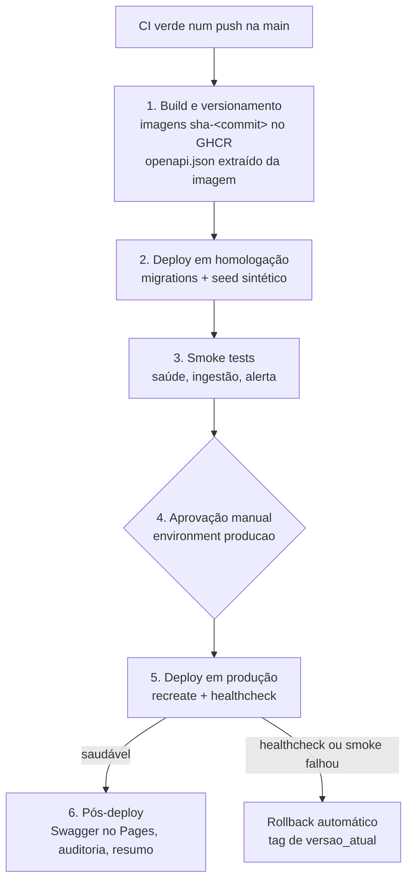

# Pipeline de CD

Entrega contínua do sistema de monitoramento e alertas. O CD começa quando o
[CI](../.github/workflows/ci.yaml) passa num push na `main` e termina quando a
versão está rodando em produção com saúde confirmada, ou revertida.

| Arquivo | Papel |
|---|---|
| [`.github/workflows/cd.yml`](../.github/workflows/cd.yml) | Pipeline principal, 6 estágios |
| [`.github/workflows/rollback.yml`](../.github/workflows/rollback.yml) | Rollback manual para qualquer tag |
| [`.github/actions/servidor`](../.github/actions/servidor/action.yml) | SSH, envio dos scripts e login no GHCR |
| [`scripts/deploy.sh`](../scripts/deploy.sh) | Migrations, recreate, healthcheck e rollback automático |
| [`scripts/smoke-test.sh`](../scripts/smoke-test.sh) | Smoke tests de homologação e produção |
| [`scripts/rollback.sh`](../scripts/rollback.sh) | Recoloca uma tag no ar |
| [`scripts/registrar-deploy.sh`](../scripts/registrar-deploy.sh) | Grava o registro de deploy na trilha de auditoria |
| [`scripts/comum.sh`](../scripts/comum.sh) | Funções compartilhadas pelos scripts |
| [`infra/docker-compose.prod.yml`](../infra/docker-compose.prod.yml) | Stack de homologação e produção |
| [`infra/Caddyfile`](../infra/Caddyfile) | Proxy: `/api/*` para o backend, o resto para o frontend |
| [`infra/.env.example`](../infra/.env.example) | Modelo do `.env` de cada ambiente no servidor |

## Fluxo



Cada estágio só começa se o anterior passou. Uma falha em homologação ou nos
smoke tests encerra o pipeline antes de chegar ao pedido de aprovação.

### 1. Build e versionamento

- Constrói as imagens do backend e do frontend **uma única vez** e publica no
  GHCR com duas tags: `sha-<commit curto>` (imutável, usada pelo deploy e pelo
  rollback) e `latest` (só conveniência).
- Homologação e produção recebem exatamente essas imagens. Nenhum estágio
  reconstrói nada.
- Sobe a própria imagem com um banco temporário, extrai o `/openapi.json`,
  valida com Redocly ([`redocly.yaml`](../redocly.yaml)) e guarda como build
  artifact. Uma spec inválida reprova o pipeline aqui.

**Por que o frontend tem um proxy na frente:** o Next embute
`NEXT_PUBLIC_API_URL` no bundle na hora do build. Com uma URL por ambiente,
seria preciso uma imagem por ambiente. A imagem é construída com
`NEXT_PUBLIC_API_URL=/api`, e o Caddy de cada ambiente encaminha `/api/*` para
o backend. Assim a imagem é a mesma em todos os ambientes, e front e back ficam
na mesma origem (cookie `SameSite=lax` continua funcionando).

### 2. Deploy em homologação

[`deploy.sh`](../scripts/deploy.sh), nesta ordem:

1. baixa as imagens novas;
2. aplica as migrations (`prisma migrate deploy`) a partir da imagem nova;
3. em homologação, roda o seed de bootstrap e o seed sintético
   ([`seed-homologacao.ts`](../kernelpanic-backend/prisma/seed-homologacao.ts));
4. troca `IMAGE_TAG` no `.env` e recria os containers;
5. healthcheck com retry (15 tentativas, 3 s de intervalo) contra `/health`,
   que só responde 200 se o banco responder.

Se qualquer passo antes do 4 falhar, a versão antiga continua no ar intacta.

**Homologação nunca recebe dados de produção** (LGPD, US01). O seed sintético
cria só a estação fictícia `SMOKE-001`, com um parâmetro e um alerta
`MAIOR_QUE 100 / EMERGENCIA`, e se recusa a rodar se `AMBIENTE` não for
`homologacao`.

#### Migrations: expand/contract obrigatório

O rollback troca só o código. **O schema nunca volta.** Por isso toda mudança
de schema precisa ser compatível com a versão anterior do código:

1. **Expand** (release N): adicionar coluna/tabela nova, nullable ou com
   default. O código antigo ignora; o novo passa a escrever.
2. **Migrar** (release N ou N+1): popular os dados novos.
3. **Contract** (release N+2 em diante): remover a coluna antiga, só depois
   que nenhuma versão em uso (nem alvo provável de rollback) a lê.

Renomear coluna, mudar tipo ou apagar coluna numa release só quebra o rollback.
O CI já impede editar migrations existentes (job `migrations`); o
expand/contract é a regra que o complementa, e hoje depende de revisão no PR.

### 3. Smoke tests

[`smoke-test.sh`](../scripts/smoke-test.sh), pelo Caddy, como um usuário real:

| Teste | Homologação | Produção | O que confere |
|---|:-:|:-:|---|
| `health` | ✓ | ✓ | `GET /api/health` 200 com `"banco":"ok"` |
| `ingestao` | ✓ | | `POST /api/ingestao/telemetria` da `SMOKE-001` → 202, e a leitura bruta está no banco (US04) |
| `alerta` | ✓ | | medida acima do limiar gera alarme `EMERGENCIA` via trigger (US06) |
| `autenticacao` | ✓ | ✓ | rota protegida sem cookie → 401; ingestão com chave errada → 401 |
| `documentacao` | | ✓ | `GET /api/openapi.json` 200 |
| `frontend` | | ✓ | `GET /login` 200 |

**Em produção nada é gravado.** Um teste de alerta em produção geraria um
alarme de emergência real, visível para a Defesa Civil. O `401` da ingestão com
chave errada vem do guard, antes de qualquer gravação, e também prova que
`INGESTAO_CHAVE_API` está configurada (se estivesse vazia, a rota ficaria
aberta).

**Limitação conhecida do teste `alerta`:** hoje a ingestão grava só em
`leituras_brutas`; ainda não existe a normalização para `medidas`, que é onde
a trigger `trg_avaliar_alerta_medida` dispara. Até essa normalização existir,
o teste insere a medida direto no banco, dentro de uma transação desfeita no
final (a trigger dispara, o alarme é conferido, nada fica gravado). Quando a
normalização existir, troque o `INSERT` por um `POST` com leitura acima do
limiar.

**Credencial:** o teste de ingestão usa a `INGESTAO_CHAVE_API` do `.env` de
homologação, que precisa ser diferente da de produção. A chave é global, não
por estação: restringir a credencial à estação fictícia depende de uma
mudança na aplicação (chave por estação), fora do escopo do CD.

#### Como adicionar um smoke test

1. Em [`smoke-test.sh`](../scripts/smoke-test.sh), escreva uma função
   `teste_<nome>` que retorna 0 (passou) ou 1 (falhou). Use `http` para
   requisições (imprime o código; o corpo sai em `corpo`) e `sql` para
   consultas (SQL pela entrada padrão, parâmetros com `-v nome=valor` e
   `:'nome'` no SQL).
2. Chame `executar <nome> teste_<nome>` no bloco `homologacao)` e/ou
   `producao)` no fim do arquivo.
3. Em produção, só entra teste que não grava nada.

O resultado de cada teste vai para o registro de deploy automaticamente.

### 4. Aprovação manual

É a regra de proteção do environment `producao` (revisor obrigatório). O job
de produção fica parado esperando até alguém aprovar.

A escolha é deliberada: **entrega contínua com gate, não deploy contínuo**. Em
sistema de Defesa Civil, publicar uma versão no meio de um evento climático
ativo é risco operacional real, e quem aprova consegue olhar para isso.

### 5. Deploy em produção

Mesmo [`deploy.sh`](../scripts/deploy.sh) de homologação, sem seed. Janela
de indisponibilidade esperada: 10–30 s, coberta pelo buffer de retransmissão
do datalogger (US03).

- **Healthcheck falhou:** o próprio `deploy.sh` volta para a tag em
  `versao_atual` e o pipeline termina com erro.
- **Smoke test de produção falhou:** o workflow chama `rollback.sh` para a
  versão anterior.

Nos dois casos a reversão vai para a trilha de auditoria com
`status: "revertido"`.

#### O arquivo `versao_atual`

Fica em `<APP_DIR>/versao_atual` no servidor e contém só a tag que está no ar
**e passou no healthcheck** (ex.: `sha-abc1234`).

- É lido antes do deploy: é o alvo do rollback automático.
- Só é escrito depois do healthcheck passar. Uma versão quebrada nunca entra
  nele, então ele sempre aponta para um alvo seguro.
- Se não existir (primeiro deploy do ambiente), uma falha não tem para onde
  voltar e o ambiente fica fora do ar até o próximo deploy ou um rollback
  manual.
- O `IMAGE_TAG` do `.env` diz o que o compose está rodando; `versao_atual` diz
  o que foi confirmado saudável. Depois de um deploy bem-sucedido os dois são
  iguais.

### 6. Pós-deploy

Só roda se o estágio 5 terminou com sucesso, e não regera nada: publica o que
o estágio 1 produziu.

- **Documentação da API (US08):** carimba `info.version` com a tag e
  `info.x-deployed-at` com o horário do deploy, gera a página com Redocly e
  publica no GitHub Pages (junto com o `openapi.json`). Como depende do
  healthcheck, a página sempre descreve o que está de fato em produção.
- **Registro de deploy (US07):** gravado ao fim do estágio 5, com sucesso ou
  falha, em `logs_auditoria` (`acao = 'deploy.producao'`, `entidade =
  'deploy'`). A tabela já é imutável no banco, e o registro fica consultável
  junto com a trilha de auditoria da aplicação. Guarda só o login do GitHub de
  quem aprovou.
- **Notificação:** resumo no próprio run do GitHub (versão, anterior,
  aprovador, indisponibilidade, migrations, smoke tests).

Exemplo de registro:

```json
{
  "deploy_id": "dep_2026_0924_12345678_1",
  "ambiente": "producao",
  "commit_sha": "abc1234ef567890...",
  "commit_em": "2026-09-24T13:02:11Z",
  "imagem": "ghcr.io/kernel-panic-fatecsjc/kp-4dsm-backend:sha-abc1234",
  "imagem_frontend": "ghcr.io/kernel-panic-fatecsjc/kp-4dsm-frontend:sha-abc1234",
  "versao_anterior": "sha-9f8e7d6",
  "downtime_segundos": 18,
  "aprovado_por": "usuario-github",
  "iniciado_em": "2026-09-24T14:22:10Z",
  "concluido_em": "2026-09-24T14:26:48Z",
  "migrations": ["20260930120000_adicionar_indice_estacao_data"],
  "smoke_tests": {
    "homologacao": { "health": "ok", "ingestao": "ok", "alerta": "ok", "autenticacao": "ok" },
    "producao": { "health": "ok", "autenticacao": "ok", "documentacao": "ok", "frontend": "ok" }
  },
  "status": "sucesso",
  "run_url": "https://github.com/Kernel-Panic-FatecSjc/KP-4DSM-API/actions/runs/12345678"
}
```

`status`: `sucesso`, `revertido`, `falha` (sem versão anterior para voltar) ou
`falha_no_rollback` (intervenção manual necessária).

## Rollback manual

Para voltar mais de uma versão, ou reverter algo que passou nos smoke tests
mas está errado:

1. Descubra a tag alvo: no resumo de um run anterior do CD, na página do pacote
   no GHCR, ou no banco:
   ```sql
   SELECT "criadoEm", detalhes->>'imagem', detalhes->>'status'
   FROM logs_auditoria WHERE acao = 'deploy.producao' ORDER BY "criadoEm" DESC;
   ```
2. **Actions → Rollback → Run workflow**: escolha o ambiente, informe a tag
   (`sha-abc1234`) e o motivo.
3. Em produção, um revisor precisa aprovar, como num deploy.

O workflow confere que as imagens existem, roda
[`rollback.sh`](../scripts/rollback.sh) (sem rebuild e sem migrations), exige
o healthcheck e grava `deploy.rollback` na trilha de auditoria com o motivo.

**Cuidado com o banco:** voltar o código é trivial, voltar o schema não. Uma
tag anterior a uma migration de *contract* pode não funcionar mais. Veja
[expand/contract](#migrations-expandcontract-obrigatório).

Sem acesso ao GitHub, direto no servidor:

```bash
/opt/kp4dsm/producao/scripts/rollback.sh sha-abc1234
```

(não grava na trilha de auditoria; registre o que foi feito depois).

## Por que não blue-green

Blue-green elimina a janela de indisponibilidade mantendo dois slots e trocando
o tráfego no proxy. Foi avaliado e **descartado** para este contexto:

- **O problema que ele resolve não existe aqui.** Projeto acadêmico, sem
  operação real. Os 10–30 s de indisponibilidade já são cobertos pelo buffer
  de retransmissão do datalogger, critério de aceitação da US03. Seria
  resolver o mesmo problema duas vezes.
- **O que importa não depende dele.** O rollback rápido vem da tag imutável
  por commit (estágio 1) e do expand/contract nas migrations (estágio 2).
  Blue-green deixa o rollback mais rápido, não mais possível.
- **O custo é complexidade, não dinheiro.** Proxy com troca de upstream,
  script de troca de slot, arquivo de estado do slot e descoberta de slot livre
  são quatro peças a mais que podem falhar.

**Quando revisitar:** se o sistema entrar em operação real com uma Defesa
Civil. Aí a janela de indisponibilidade vai coincidir com uma emergência
climática em algum momento, e blue-green passa a ser necessário.

**A migração é incremental:** só o estágio 5 muda. O Caddy já está na frente
dos containers, então a troca de slot vira uma mudança de upstream no
Caddyfile. Build, homologação, smoke tests, gate e pós-deploy continuam iguais.

## Métricas DORA

Os registros `deploy.producao` e `deploy.rollback` em `logs_auditoria` bastam
para as quatro métricas:

| Métrica | Como calcular |
|---|---|
| Frequência de deploy | registros `deploy.producao` com `status = 'sucesso'` por período |
| Lead time para mudanças | `concluido_em - commit_em` |
| Taxa de falha em mudanças | registros com `status <> 'sucesso'` ÷ total, somando os rollbacks manuais que vieram depois de um deploy |
| Tempo médio de recuperação | de um deploy com falha (ou do deploy que motivou um rollback manual) até o próximo `sucesso` |

```sql
SELECT detalhes->>'concluido_em' AS concluido_em,
       detalhes->>'status' AS status,
       EXTRACT(EPOCH FROM (detalhes->>'concluido_em')::timestamptz
                        - (detalhes->>'commit_em')::timestamptz) / 3600 AS lead_time_horas
FROM logs_auditoria
WHERE acao = 'deploy.producao'
ORDER BY "criadoEm";
```

## Configuração inicial (uma vez)

### Preparar o servidor

Na VPS, com Docker e o plugin Compose instalados:

```bash
# usuário de deploy, sem senha, só com chave SSH
sudo adduser --disabled-password deploy
sudo usermod -aG docker deploy

# um diretório por ambiente
sudo mkdir -p /opt/kp4dsm/homologacao /opt/kp4dsm/producao
sudo chown deploy: /opt/kp4dsm/homologacao /opt/kp4dsm/producao
```

Em cada diretório, crie o `.env` a partir de
[`infra/.env.example`](../infra/.env.example). Pontos que mudam entre os
ambientes:

- `AMBIENTE` e `COMPOSE_PROJECT_NAME` (`kp4dsm-homologacao` / `kp4dsm-producao`);
- `HTTP_PORT`/`HTTPS_PORT`, se os dois ambientes ficarem na mesma VPS;
- senhas, `JWT_SECRET` e `INGESTAO_CHAVE_API`: **todos diferentes** entre
  homologação e produção.

O `.env` só existe no servidor e nunca é versionado. O pipeline só altera a
linha `IMAGE_TAG`.

Em produção, o usuário administrador inicial é criado **uma vez, à mão**,
depois do primeiro deploy (o pipeline só roda seeds em homologação):

```bash
cd /opt/kp4dsm/producao
docker compose -f docker-compose.prod.yml --env-file .env run --rm api npm run db:seed
```

### Configurar o GitHub

1. **Environments** (Settings → Environments):
   - `homologacao`: sem regra de proteção.
   - `producao`: *Required reviewers* com quem pode aprovar deploys, e
     *Deployment branches* restrito a `main`.
2. **Secrets de cada environment** (os mesmos nomes nos dois; os valores
   podem apontar para a mesma VPS):

   | Secret | Conteúdo |
   |---|---|
   | `VPS_HOST` | IP ou hostname da VPS |
   | `VPS_USUARIO` | `deploy` |
   | `VPS_CHAVE_SSH` | chave privada do usuário de deploy |
   | `VPS_KNOWN_HOSTS` | saída de `ssh-keyscan -H <host>`, conferida à mão |

3. **Variables de cada environment** (opcionais):

   | Variable | Padrão |
   |---|---|
   | `APP_DIR` | `/opt/kp4dsm/<ambiente>` |
   | `VPS_PORTA` | `22` |
   | `URL_PUBLICA` | (nenhuma; só aparece como link do environment) |

4. **Pages** (Settings → Pages): *Source* = GitHub Actions.
5. **Pacotes:** depois do primeiro build, confira em cada pacote do GHCR
   (`kp-4dsm-backend`, `kp-4dsm-frontend`) que ele está vinculado a este
   repositório. Sem o vínculo, o `GITHUB_TOKEN` do rollback e do servidor não
   consegue baixar as imagens.

## Segurança e LGPD

- Nenhuma credencial em arquivo versionado. Chaves de SSH ficam em secrets de
  environment, e as credenciais da aplicação ficam no `.env` do servidor, sem
  passar pelo runner.
- Os scripts leem o `.env` chave por chave (`ler_env`), sem `source`, e nenhum
  passo imprime variáveis de ambiente inteiras. O seed de bootstrap imprime a
  senha do admin, e o `deploy.sh` mascara essa linha no log.
- `known_hosts` vem de secret, e não de `ssh-keyscan` na hora do deploy.
- O banco não publica porta; só é alcançável pela rede interna do compose.
- O registro de deploy guarda só o login do GitHub de quem aprovou.
- Homologação nunca recebe dump de produção.

## Fora do escopo por enquanto

- **Firmware do ESP32** (build PlatformIO, release, OTA).
- **Changelog e ERD:** o briefing coloca a geração no CI; quando o CI
  produzir esses artefatos, o estágio 6 pode publicá-los junto com a API.
- **Anotações OpenAPI** (`@ApiOperation`, `@ApiProperty`, `@ApiSecurity`): a
  spec já lista todas as rotas, mas sem descrições nem schemas dos DTOs. O
  plugin de CLI do `@nestjs/swagger` não foi ativado porque não aceita os
  tipos inline de alguns DTOs (ex.: `sensores` em `EstacaoRespostaDto`).
